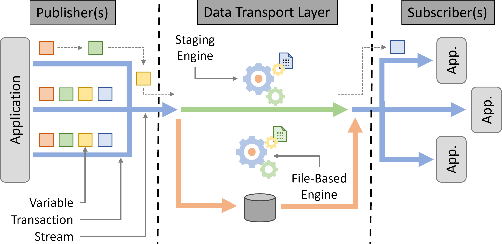

.. Copyright 2025

.. _intro_concepts:

Introduction
============

What is DTLMod
---------------
A **data transport layer** can is the central component in a **publish-subscribe system**, that connects applications
that produce data objects to those which consume them, moves these data objects, and keeps track of metadata.

The figure below shows a generic data transport layer and introduces the terminology by DTLMod.

.. raw:: html

     

On the publisher side, one or more applications (e.g., large-scale physics simulations) produce data, represented by
multiple **variables**, and publish them to the DTL within a **transaction** using a specific **stream**. On the
subscriber side, one or more applications (e.g., analysis and visualization components) subscribe to specific streams
to retrieve the data they need from the DTL. The DTL itself exposes multiple **engines** in charge of the actual data
transport from the publisher(s) to the subscriber(s). These engines either rely on **files** stored on a file system
or use **staging** techniques to move data in memory or over the network. 

DTLMod builds on the low-level abstractions exposed by the `SimGrid toolkit <https://simgrid.org/>`_. Typical
SimGrid-based simulators are composed of multiple **actors** (i.e., simulated processes) that launch 
**activities** (i.e., computations, network communications, or I/O operations) defined by an amount of work to do (e.g.,
bytes to read, write, or transfer, compute operations to perform) on **resources** (i.e., CPUs, network links, or
disks). The simulation models at the core of SimGrid determine the respective completion date of these activities to
make the simulated time advance. DTLMod combines these low-level abstractions to expose higher-level concepts and ease
the writing of simulators of in situ processing. 

What DTLMod allows you to do
----------------------------

  - **Prototype**.
  - **Compare**. 
  - **Explore**.