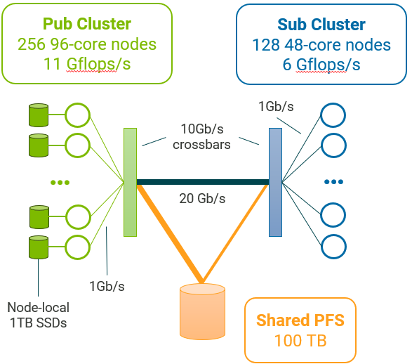

.. Copyright 2025-2026

.. _Platform:

Describing your simulated platform
==================================

DTLMod relies on `SimGrid's C++ programmatic platform description interface
<https://simgrid.org/doc/latest/Platform_cpp.html>`_ to allow you to describe the computing and storage resources on
which to simulate the execution of your in situ processing workflow.

To describe a platform in C++, the recommended approach is to create a separate C++ file, compiled as a shared library,
in which you will overload the definition of the :cpp:func:`simgrid::s4u::Engine::load_platform` function. This way you
can decouple the definition of your platform from the code of your simulation. The generated shared library can then be
passed as a command line argument of your simulator binary.

.. code-block:: c++

    extern "C" void load_platform(const simgrid::s4u::Engine& e);
    void load_platform(const simgrid::s4u::Engine& e)
    {
        // Here goes your platform description
    }

Describing Resources
********************

NetZones
^^^^^^^^
A **netzone** is a network container, in charge of routing information between computing resources (i.e., hosts) and to
the nearby netzones. In SimGrid, there is a hierarchy of netzones, with a unique **root** zone that you can retrieve
with :cpp:func:`simgrid::s4u::Engine::get_netzone_root()`. 

To add a new netzone to the hierarchy, you must decide of the routing method you want to apply (e.g., **empty**, 
**full**, **star**, **Floyd**, **Dijkstra**, **fatTree**, **torus**, **dragonfly**). For instance, to create a 
compute cluster with a single crossbar switch, you can use the **star** routing method:

.. code-block:: c++

    auto* cluster = e.get_netzone_root()->add_netzone_star("cluster");

Hereafter, we explain how to add resources to your platform. The different resources, such as **hosts**, **disks**, or
**network links**, follow the same idiom: :cpp:func:`add()->set()->set()`.

Hosts
^^^^^

A host models some physical resource with **computing** and **networking** capabilities on which simulated **actors**
execute. They are minimally defined by a **unique name** and **processing speed** (expressed as a number of floating
point operations per second). You can also further `configure your hosts 
<https://simgrid.org/doc/latest/app_s4u.html#modifying-characteristics>`_.

Hosts can be added to a netzone as follows:

.. code-block:: c++

    for (int i = 0; i < 4; i++) {
      std::string hostname = std::string("node-") + std::to_string(i);
      auto* host           = cluster->add_host(hostname, "1Gf");
    }

Here we define four hosts named ``node-0``, ``node-1``, ``node-2``, and ``node-3`` each being able to process a
gigaflop per second. 

Disks
^^^^^
A disk models some physical device with **I/O** capabilities. Disks are minimally defined by a **unique name**, a
**read bandwidth** and a **write bandwidth** (both expressed in bytes per second). By default, SimGrid does not keep track of the actual data being
written but only computes the time taken by the corresponding data movement. The simulation of file systems is handled
by `FSMod <https://github.com/simgrid/file-system-module>`_ (see :ref:`Platform_storage`).

Disks can be added to a host as follows:

.. code-block:: c++

   auto* nvme = host->add_disk("node-0_nvme", "560MBps", "510MBps");

Links
^^^^^

A link represents the network facilities between hosts. They are minimally defined by a **name** and a **bandwidth**
(expressed in bytes per second). You can further configure a link with a **latency** and a **sharing policy**. These
can be combined into **routes** to model the interconnection network within and between zones.

For instance to connect each of the hosts of our four host cluster, we add the following code

.. code-block:: c++

    const auto* backbone = cluster->add_link("backbone", "10Gbps")->set_latency("1ms");
    auto* link_up        = cluster->add_link(hostname + "_LinkUP", "1Gbps")->set_latency("2ms");
    auto* link_down      = cluster->add_link(hostname + "_LinkDOWN", "1Gbps")->set_latency("2ms");
    auto* loopback       = cluster->add_link(hostname + "_loopback", "1Gbps")->set_latency("1.75ms")
                                  ->set_sharing_policy(sg4::Link::SharingPolicy::FATPIPE);

    cluster->add_route(host, nullptr, {sg4::LinkInRoute(link_up), sg4::LinkInRoute(backbone)}, false);
    cluster->add_route(nullptr, host, {sg4::LinkInRoute(backbone), sg4::LinkInRoute(link_down)}, false);
    cluster->add_route(host, host, {loopback});

.. _Platform_storage:

Storage and file system
***********************

DTLMod relies on FSMod's C++ programmatic description interface to allow you to describe storage components
and file systems. For instance, to describe a **one disk storage** on the disk attached to a host, start a **file
system** on that storage, and **mount a partition**, you have to add the following code:

.. code-block:: c++

    auto local_nvme = simgrid::fsmod::OneDiskStorage::create(hostname + "_local_nvme", nvme);
    auto local_fs   = sgfs::FileSystem::create("local_fs", 100000000);
    local_fs->mount_partition("/scratch/", local_nvme, "1TB");

    // Register the file system to the NetZone it is in
    simgrid::fsmod::FileSystem::register_file_system(cluster, local_fs);

Full example
************

The best way to build your C++ platform is to start from some examples. Each of the tests in our test suite begins with
the definition of a small platform (of different complexity depending on the test).

Here, we present a complete example that corresponds to the platform used in the research paper introducing DTLMod.

.. raw:: html

     

This simulated platform is composed of two homogeneous clusters. The first cluster comprises 256 96-core nodes while the
second cluster has 128 48-core nodes. Each core of these clusters can respectively process :math:`11 \times 10^9` and
:math:`6 \times 10^9` floating point operations per second. These clusters have the same internal network topology:
Nodes are connected through 1 Gb/s private network links to a 10 Gb/s crossbar switch.  The two clusters are
interconnected through a single 20 Gb/s network link.

Each node of the first cluster has a scratch space of 1 TB on a SSD disk whose read and write bandwidths are 560 MB/s
and 510 MB/s respectively. Both clusters share access to a 100 TB file system whose read and write bandwidths are
180 MB/s and 160 MB/s respectively. The first cluster is connected to this remote file system through a 20 Gb/s network
link, while the second cluster has a slower connection at 10 Gb/s.

.. literalinclude:: platform.cpp
   :language: cpp
