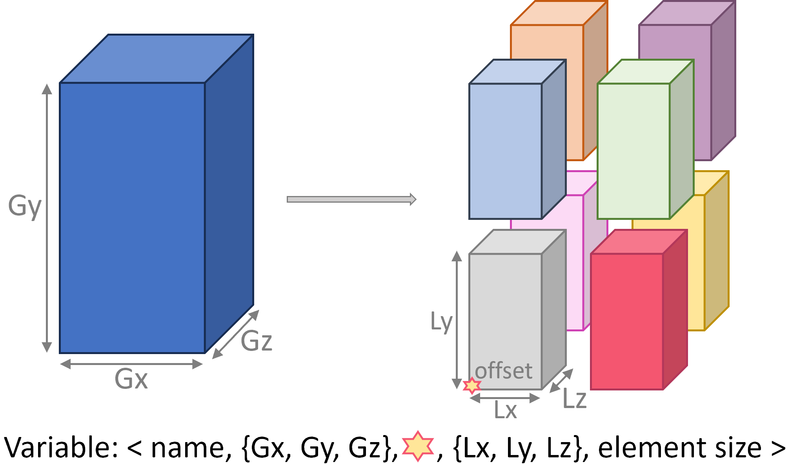

.. Copyright 2025

.. _DTLMod_doc:

The DTLMod programming interface
################################

.. image:: img/DTL-overview.png
   :width: 80% 
   :align: center

.. raw:: html

     

.. _DTLMod_main_concepts:

Main Concepts
*************

DTL
^^^
.. |Concept_DTL| replace:: **DTL**
.. _Concept_DTL:

TBD

Variables
^^^^^^^^^^
.. |Concept_Variable| replace:: **Variable**
.. _Concept_Variable:

At the core of the DTLMod is the data transported from publishers to subscribers. Many in situ processing workflows
involve parallel MPI codes as data producers. These codes manipulate **multidimensional arrays** distributed over
multiple ranks. DTLMod adopts this data structure as the basis of its |Concept_Variable|_ abstraction.

The figure below illustrates shows how to define a 3-dimensional array, distributed to eight MPI ranks organized in 
a :math:`2 \times 2 \times 2` grid, as a **self-descriptive tuple**.

.. raw:: html

     

This tuple stores the **name** of the variable (that is unique to a given |Concept_Stream|_), the **global dimensions**
of the multidimensional array (:math:`G_x`, :math:`G_y`, and :math:`G_z`) and, for each rank, the **local part**
(:math:`L_x`, :math:`L_y`, and :math:`L_z`) owned by that rank after decomposition and distribution, and a
**3D-offset** (represented by a star in the figure) that indicates where the local array is positioned in the global
array. Finally, the tuple stores the **size of the elements** in the array.

Streams
^^^^^^^
.. |Concept_Stream| replace:: **Stream**
.. _Concept_Stream:

TBD

Engines
^^^^^^^
.. |Concept_Engine| replace:: **Engine**
.. _Concept_Engine:

TBD

Transactions
^^^^^^^^^^^^
.. |Concept_Transaction| replace:: **Transaction**
.. _Concept_Transaction:

TBD