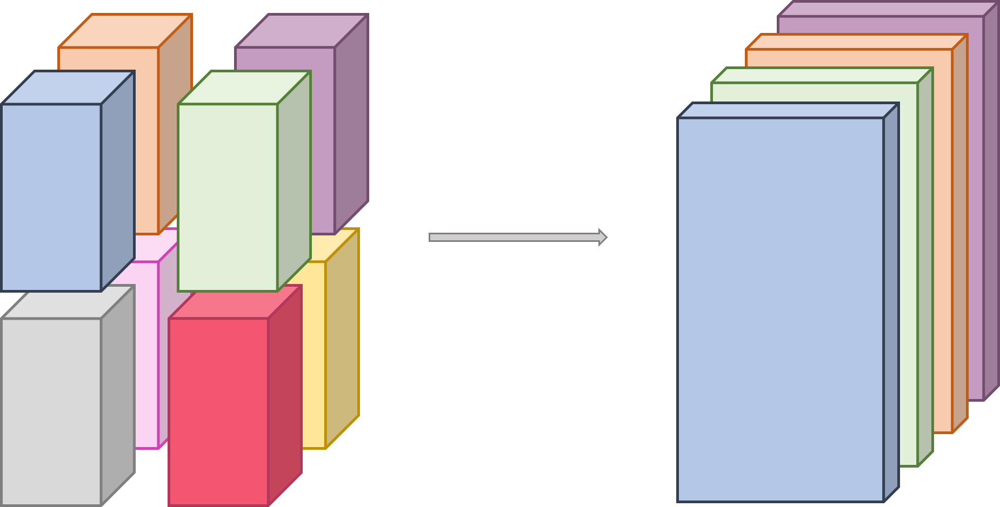

.. Copyright 2025

.. _DTLMod_API:

The DTLMod programming interface
################################

.. image:: img/DTL-overview.png
   :width: 80% 
   :align: center

.. raw:: html

     

.. _DTLMod_main_concepts:

Main Concepts
*************

.. |Concept_DTL| replace:: **DTL**
.. _Concept_DTL:

DTL
^^^

A |Concept_DTL|_ is created by calling :cpp:func:`DTL::create() <dtlmod::DTL::create()>` at the beginning of the
:cpp:func:`main()` function of your simulator. This function can take as an optional argument a JSON configuration
file that describes the different |Concept_Streams|_ to be created during the simulation each with a **name**,
|Concept_Engine|_ type, and |Concept_Transport|_ method.

A common in situ processing scenario is that some analyses or visualization are only needed when certain conditions
are met. In such cases, a new process is spawned, subscribes to some variables, and analyzes or visualizes data.
DTLMod has been designed to enable the development of simulators in which actors can connect to or disconnect from the
|Concept_DTL|_ at any time. A |Concept_DTL|_ thus remains active from its creation until the end of the simulation when
it is automatically destroyed.

Internally, a |Concept_DTL|_ is implemented as a server daemon process that answers **connection** and
**disconnection** requests from the simulated actors and maintains the set of active connections.

.. |Concept_Stream| replace:: **Stream**

.. |Concept_Streams| replace:: **Streams**

.. _Concept_Streams:

.. _Concept_Stream:

Stream
^^^^^^

The |Concept_Stream|_ abstraction represents a connection between a simulated actor and the DTL, through which data
transport operations occur, and acts as a |Concept_Variable|_ factory. The publishers **define** the variables a
|Concept_Stream|_ has to transport. Each publisher provides **global and local information** about the variable
(see |Concept_Variable|_ abstraction) On the subscribers side, actors first have to **inquire**
about a variable (i.e., to know its shape and size) before being able to retrieve it from the DTL. Actors can also
obtain a list of the names of the variables associated to a stream. Finally, opening a |Concept_Stream|_  creates a
specific |Concept_Engine|_ to actually handle data transport.

.. |Concept_Engine| replace:: **Engine**
.. _Concept_Engine:

Engine
^^^^^^
The |Concept_Engine|_ abstraction is the base interface through which the |Concept_DTL|_ interacts with the simulated
communication or I/O subsystems in charge of the simulation of data movement or storage. DTLMod exposes two types of
engines: **file-based** engines, that write and read data to and from storage and **staging** engines that stream data
from the memory of publishers to that of subscribers.

An |Concept_Engine|_ are attached to a |Concept_Stream|_. A simulated actor can thus adapt the type of
|Concept_Engine|_ to the purpose of each individual |Concept_Stream|_. For instance, one will create a stream with a
file-based engine to store application checkpoints and another stream with a staging engine to transfer data from one
analysis component to another. The type of |Concept_Engine|_ to use can be specified either at the creation of a
|Concept_Stream|_ or in an external configuration file passed as argument when creating the |Concept_DTL|_.

.. |Concept_Transport| replace:: **Transport**
.. _Concept_Transport:

Transport method
^^^^^^^^^^^^^^^^

An engine is then associated to a specific |Concept_Transport|_ **method** that further specifies how data is written
to and read from a file system or streamed from one workflow component to another. This separation between
|Concept_Engine|_ and |Concept_Transport|_ method allows you to switch between multiple implementations of the same
service without having to modify the code of your in situ workflow simulator: Changing of transport method simply
amounts to modifying a configuration parameter of the |Concept_Stream|_.

For file-based engines, the default transport method consists in having each publisher simulate the writing, for each
|Concept_Transaction|_, of its own share of a |Concept_Variable|_ in a distinct simulated file located on a specified
simulated storage space.

When a subscriber requests a (selection of a) |Concept_Variable|_ with a different access pattern, DTLMod first
computes which files contain the different pieces of the requested variable and then simulates the corresponding read
operations of these files, wherever they are virtually stored. The simulation of these I/O operations is delegated to
the `file system module of SimGrid <https://github.com/simgrid/file-system-module>`_ that exposes high-level
abstractions for the simulation of file-system operations on local and remote storage.

To create a **file-based** |Concept_Engine|_, you must specify where to store the simulated files. This is done by
passing as argument to the :cpp:func:`Stream::open() <dtlmod::Stream::open()>` method a string which contains the
location and name of the targeted file system and a path to a specific directory. This information can also be stored
in a separate configuration file, which means that you can test different scenarios (e.g., using a local or remote file
system) without having to modify the code of their simulator.

The location of the file system has a direct impact on the simulation of I/Os by SimGrid's file system module. If the
DTL accesses a remote file system, a write (resp. read) operation implies the simulation of a network communication
before (resp. after) the simulation of the corresponding I/O operation on a storage device.

DTLMod exposes two |Concept_Transport|_ methods for staging engines. The first method simulates both **memory copy**
and **network transfer** while ensuring the respect of flow dependencies. Whether a data copy or transfer is simulated
depends on the respective mapping of the publisher and subscriber on computing resources. If both run on the same node,
they virtually share a memory space, and DTLMod simulates a deep memory copy---as an intra-communication whose
performance can be configured in description of the simulated platform. Otherwise, it simulates a network
communication.

To implement this, DTLMod leverages `SimGrid's **mailbox** abstraction
<https://simgrid.org/doc/latest/app_s4u.html#mailboxes>`_ which acts as a rendez-vous point between actors. Only when
two actors meet on such a rendez-vous point, the simulation of a memory copy or data transfer starts.

The second transport method provides you with a **"what if an ideal transport existed?"** baseline for your performance
evaluation studies, e.g., all the data exchanges made through the DTL take zero time. This method leverages another
abstraction exposed by SimGrid to simulate inter-process communications: **Message queues** have the same semantic and
purpose as **mailboxes**, ensuring the respect of control and flow dependencies, but do not induce any simulated time.

When streaming data, a :math:`M \times N` data redistribution among *M* publishers and *N* subscribers may be
necessary. The exact redistribution pattern is automatically determined by DTLMod in three steps:

  1. When a publisher **puts** a variable into a stream, it asynchronously waits for data requests (using
     zero-simulated-cost message queues) from any subscriber that opened that stream;
  2. When a subscriber **gets** (a subset of) this variable from the stream, it computes which publishers own pieces
     of its local view of the variable and send them each a request to put the corresponding pieces, defined by offsets
     and element counts, in dedicated mailboxes (resp. message queues);
  3. When publishers end their transaction, they asynchronously put the requested pieces in these mailboxes (resp.
     message queues). DTLMod then simulates the corresponding data exchanges, and may possibly force actors to wait for
     their completion when a new transaction starts.

.. |Concept_Variable| replace:: **Variable**
.. _Concept_Variable:

Variable
^^^^^^^^

At the core of the DTLMod is the data transported from publishers to subscribers. Many in situ processing workflows
involve parallel MPI codes as data producers. These codes manipulate **multidimensional arrays** distributed over
multiple ranks. DTLMod adopts this data structure as the basis of its |Concept_Variable|_ abstraction.

The figure below illustrates shows how to define a 3-dimensional array, distributed to eight MPI ranks organized in 
a :math:`2 \times 2 \times 2` grid, as a **self-descriptive tuple**.

.. raw:: html

     

This tuple stores the **name** of the variable (that is unique to a given |Concept_Stream|_), the **global dimensions**
of the multidimensional array (:math:`G_x`, :math:`G_y`, and :math:`G_z`) and, for each rank, the **local part**
(:math:`L_x`, :math:`L_y`, and :math:`L_z`) owned by that rank after decomposition and distribution, and a
**3D-offset** (represented by a star in the figure) that indicates where the local array is positioned in the global
array. Finally, the tuple stores the **size of the elements** in the array.

.. |Concept_Transaction| replace:: **Transaction**
.. _Concept_Transaction:

Transaction
^^^^^^^^^^^

Simulated actors can publish, or subscribe to, one or more |Concept_Variable|_ variables within a
|Concept_Transaction|_. This logical construct delimits the interactions between an actor and the |Concept_DTL|_ and
enables the synchronization between publishers and subscribers.

When a simulated actor starts a new |Concept_Transaction|_  on a |Concept_Stream|_, DTLMod makes it wait for the
completion of any in-flight data transport activity from the previous transaction on that stream.

Actors that subscribe to a |Concept_Variable|_ can also, before beginning a new transaction, **select** a specific
subset of the multidimensional array this |Concept_Variable|_ represents (e.g.,  to focus on a smaller region of
interest or adapt the decomposition and distribution of the variable to subsequent data processing). The figure
below illustrates such a selection, made on the subscriber side. Four actors subscribe to the 3D variable defined the
previous section and select blocks of 2D slices, along the Z-dimension.

.. raw:: html

     

During its execution, a simulated actor can perform several transactions to model the periodic production of data, its
transport, and analysis to monitor the progress of an iterative computation. For any |Concept_Variable|_, DTLMod keeps
as metadata which actor(s) published it and in which transaction(s). This allows subscriber(s) to select specific
transaction(s) when retrieving data from the |Concept_DTL|_.

.. =================================================================================================
.. =================================================================================================
.. ========================================= API REFERENCE =========================================
.. =================================================================================================
.. =================================================================================================

----------------------------------------------------------------------------------------------------

API Reference
*************

.. _API_dtlmod_DTL:

class DTL
^^^^^^^^^

A class that implements a Data Transport Layer abstraction.

Creation
---------

.. tabs::

   .. group-tab:: C++

      .. code:: C++

         #include <dtlmod/DTL.hpp>

      .. doxygenfunction:: dtlmod::DTL::create()   
      .. doxygenfunction:: dtlmod::DTL::create(const std::string& config_filename)

   .. group-tab:: Python

      .. code:: Python

         import dtlmod

      .. automethod:: dtlmod.DTL.create   

Connection and Deconnection
---------------------------
.. tabs::

   .. group-tab:: C++

      .. doxygenfunction:: dtlmod::DTL::connect()
      .. doxygenfunction:: dtlmod::DTL::disconnect()
      .. doxygenfunction:: dtlmod::DTL::has_active_connections

   .. group-tab:: Python

      .. automethod:: dtlmod.DTL.connect
      .. automethod:: dtlmod.DTL.disconnect
      .. autoproperty:: dtlmod.DTL.has_active_connections

Stream factory
--------------
.. tabs::

   .. group-tab:: C++

      .. doxygenfunction:: dtlmod::DTL::add_stream(const std::string& name)
      .. doxygenfunction:: dtlmod::DTL::get_stream_by_name_or_null(const std::string& name) const
      .. doxygenfunction:: dtlmod::DTL::get_all_streams

   .. group-tab:: Python

      .. automethod:: dtlmod.DTL.add_stream
      .. automethod:: dtlmod.DTL.stream_by_name_or_null
      .. autoproperty:: dtlmod.DTL.all_streams

.. _API_dtlmod_Stream:

class Stream
^^^^^^^^^^^^

Configuration
-------------
.. tabs::

   .. group-tab:: C++

      .. doxygenfunction:: dtlmod::Stream::set_engine_type(const Engine::Type& engine_type)
      .. doxygenfunction:: dtlmod::Stream::set_transport_method(const Transport::Method& transport_method)
      .. doxygenfunction:: dtlmod::Stream::set_metadata_export()
      .. doxygenfunction:: dtlmod::Stream::unset_metadata_export()

   .. group-tab:: Python

      .. automethod:: dtlmod.Stream.set_engine_type
      .. automethod:: dtlmod.Stream.set_transport_method
      .. automethod:: dtlmod.Stream.set_metadata_export
      .. automethod:: dtlmod.Stream.unset_metadata_export

Properties
----------
.. tabs::

   .. group-tab:: C++

      .. doxygenfunction:: dtlmod::Stream::get_engine_type_str() const
      .. doxygenfunction:: dtlmod::Stream::get_transport_method_str() const
      .. doxygenfunction:: dtlmod::Stream::get_access_mode_str() const
      .. doxygenfunction:: does_export_metadata() const

   .. group-tab:: Python

      .. autoproperty:: dtlmod.Stream.engine_type
      .. autoproperty:: dtlmod.Stream.transport_method
      .. autoproperty:: dtlmod.Stream.access_mode
      .. autoproperty:: dtlmod.Stream.metadata_export

Engine factory
--------------
.. tabs::

   .. group-tab:: C++

      .. doxygenfunction:: dtlmod::Stream::open(const std::string& name, Mode mode)
      .. doxygenfunction:: dtlmod::Stream::get_num_publishers() const
      .. doxygenfunction:: dtlmod::Stream::get_num_subscribers() const

   .. group-tab:: Python

      .. automethod:: dtlmod.Stream.open
      .. autoproperty:: dtlmod.Stream.num_publishers
      .. autoproperty:: dtlmod.Stream.num_subscribers

Variable factory
----------------
.. tabs::

   .. group-tab:: C++

      .. doxygenfunction:: dtlmod::Stream::define_variable(const std::string& name, size_t element_size)
      .. doxygenfunction:: dtlmod::Stream::define_variable(const std::string& name, const std::vector<size_t>& shape, const std::vector<size_t>& start, const std::vector<size_t>& count, size_t element_size)
      .. doxygenfunction:: dtlmod::Stream::inquire_variable(const std::string& name) const
      .. doxygenfunction:: dtlmod::Stream::remove_variable(const std::string& name)
      .. doxygenfunction:: dtlmod::Stream::get_all_variables() const

   .. group-tab:: Python

      .. automethod:: dtlmod.Stream.define_variable
      .. automethod:: dtlmod.Stream.inquire_variable
      .. automethod:: dtlmod.Stream.remove_variable
      .. autoproperty:: dtlmod.Stream.all_variables

.. _API_dtlmod_Engine:

class Engine
^^^^^^^^^^^^
Properties
----------

.. tabs::

   .. group-tab:: C++

      .. doxygenfunction:: dtlmod::Engine::get_name() const
      .. doxygenfunction:: dtlmod::Engine::get_cname() const
      .. doxygenfunction:: dtlmod::Engine::get_current_transaction() const
      .. doxygenfunction:: dtlmod::Engine::get_metadata_file_name() const

   .. group-tab:: Python

      .. autoproperty:: dtlmod.Engine.name
      .. autoproperty:: dtlmod.Engine.current_transaction
      .. autoproperty:: dtlmod.Engine.metadata_file_name

Transactions
------------
.. tabs::

   .. group-tab:: C++

      .. doxygenfunction:: dtlmod::Engine::begin_transaction()
      .. doxygenfunction:: dtlmod::Engine::put(std::shared_ptr<Variable> var) const
      .. doxygenfunction:: dtlmod::Engine::put(std::shared_ptr<Variable> var, size_t simulated_size_in_bytes) const
      .. doxygenfunction:: dtlmod::Engine::get(std::shared_ptr<Variable> var) const
      .. doxygenfunction:: dtlmod::Engine::end_transaction()

   .. group-tab:: Python

      .. automethod:: dtlmod.Engine.begin_transaction
      .. automethod:: dtlmod.Engine.put
      .. automethod:: dtlmod.Engine.get
      .. automethod:: dtlmod.Engine.end_transaction

.. _API_dtlmod_Variable:

class Variable
^^^^^^^^^^^^^^

Properties
----------
.. tabs::

   .. group-tab:: C++

      .. doxygenfunction:: dtlmod::Variable::get_name() const
      .. doxygenfunction:: dtlmod::Variable::get_cname() const
      .. doxygenfunction:: dtlmod::Variable::get_shape() const
      .. doxygenfunction:: dtlmod::Variable::get_element_size() const
      .. doxygenfunction:: dtlmod::Variable::get_global_size() const
      .. doxygenfunction:: dtlmod::Variable::get_local_size() const

   .. group-tab:: Python
      .. autoproperty:: dtlmod.Variable.name
      .. autoproperty:: dtlmod.Variable.shape
      .. autoproperty:: dtlmod.Variable.element_size
      .. autoproperty:: dtlmod.Variable.global_size
      .. autoproperty:: dtlmod.Variable.local_size

Selection
---------
.. tabs::

   .. group-tab:: C++

      .. doxygenfunction:: dtlmod::Variable::set_selection(const std::vector<size_t>& start, const std::vector<size_t>& count)
      .. doxygenfunction:: dtlmod::Variable::set_transaction_selection(unsigned int transaction_id)
      .. doxygenfunction:: dtlmod::Variable::set_transaction_selection(unsigned int begin, unsigned int count)
   .. group-tab:: Python
      .. automethod:: dtlmod.Variable.set_selection
      .. automethod:: dtlmod.Variable.set_transaction_selection

